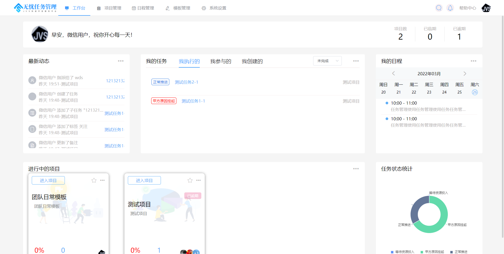
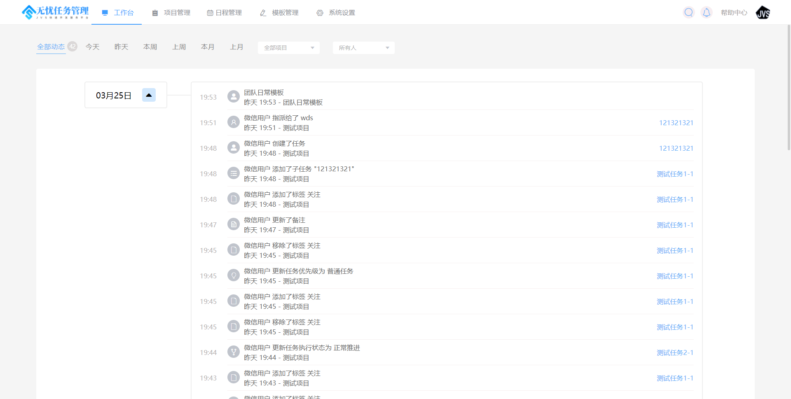
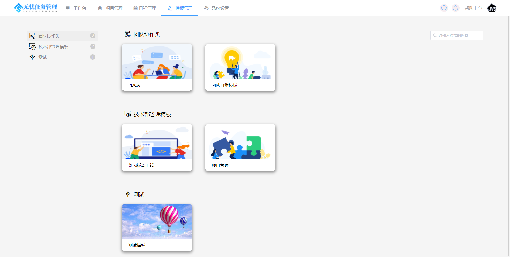
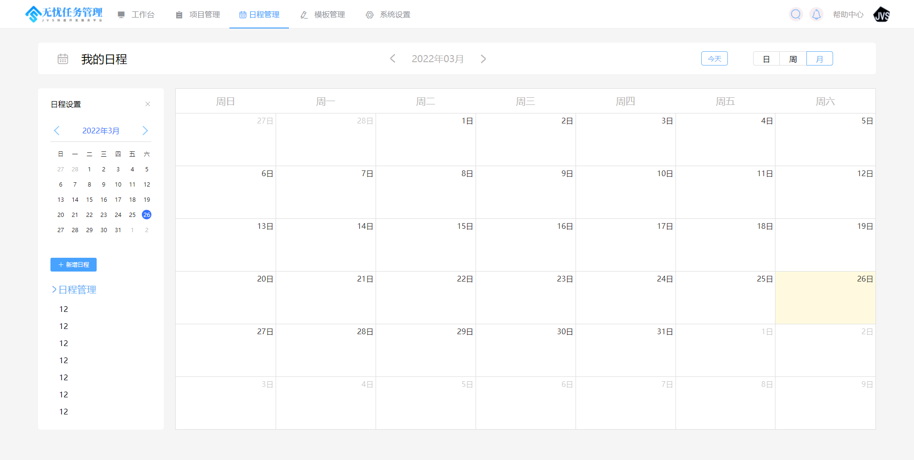
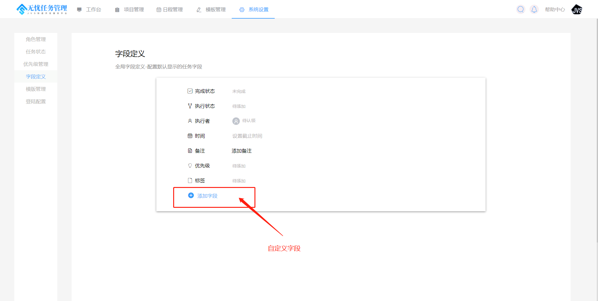
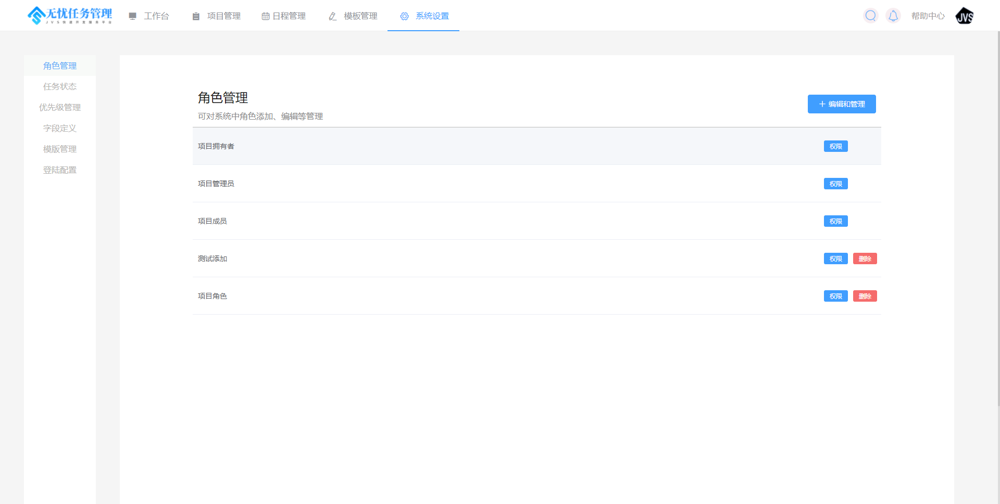

### 项目概述
任务管理是企业协同的重要组成部分。
     任务管理是企业内部事务协同的重要工具，与传统的OA有类似之处，都是推动企业内部事务有效快速的推进，但之前存在不同之处，OA是属于刚性流程化的管理，侧重于流程与规范，任务管理侧重于人员、事务之间的协同，侧重于灵活度与协同性上
    从灵活度上看，可以用于企业各种事务的管理与处理，比如客户进展管理、开发进度、产品设计等，那么灵活度的核心是提供有效的模板管理与配置；
协同性上看，可以有效的提供团队的事务进展的同步与推进，便捷有效的查看方式；

### 项目组成
企业文档分为业务前台与管理后台，项目由 业务前台与管理后台组成
业务前台前端地址：https://github.com/RKQF-JVS/jvs-teamwork-ui
业务前台后端地址：https://github.com/RKQF-JVS/jvs-teamwork

### 技术栈说明
* JVS+VUE
* Spring Cloud Alibaba
* VUE+Element UI

### 项目核心功能（四大板块）
* 项目管理（项目-任务wbs）
 -wbs任务分解
 -
* OKR目标管理
* 个人待办
* 管理配置

### 体验地址与账号说明
账号说明：
* 普通用户端：体验者自有微信扫码登录
* 管理端(全网共享)：testadmin 123456
* 管理端+应用编辑：联系运营微信号 ruanjbz，开设独立环境与独立账号
* 管理端+平台配置+应用编辑：联系运营微信号 ruanjbz，获取私有化部署文档与安装包
地址说明（系列产品）：
* 管理平台（含管理平台、低代码、数据智仓）：https://frame.bctools.cn/
* 企业文档：http://knowledge.bctools.cn/
* 企业计划（项目管理）：http://teamwork.bctools.cn/
* 企业邮筒（Web邮箱客户端）：http://mailbox.bctools.cn/
* 规则引擎：http://jvs-rules.bctools.cn/
* 视频会议：http://meeting.bctools.cn/

### 部分截图

### 使用与授权
无忧企业文档采用开源模式，在合规备案情况下，支持自用与商用，商用提供100%源代码。
### 版本说明：
使用用途|费用模式|使用条件|授权时间
-|-|-|-
个人学习、个人使用|免费|免费备案|永久
商用、二次开发|收费、代码交付|技术服务合同+商用备案|永久

### 商用费用说明：
- > 技术服务费，必选，具体费用请与商务沟通
- > 定制开发费，可选，1500元/人天
- > 部署费用，可选，500元/次
- > 长期运维，可选，协商

备案说明：联系我们的商务人员，在线备案，备案内容：项目名称，使用模式（自用/商用），备案主体主体，备案联系人员，即可。
### 禁止行为（为了保障产品走得更远）：
* 在未获得我方认可分发代码的情况下，禁止以任何形式进行代码分发（包含但不限于代码拷贝、代码公开、代码开源、代码分享等行为）
* 禁止在未备案的情况下，私自使用（包含自用与商用）

### 技术交流与商务支持

